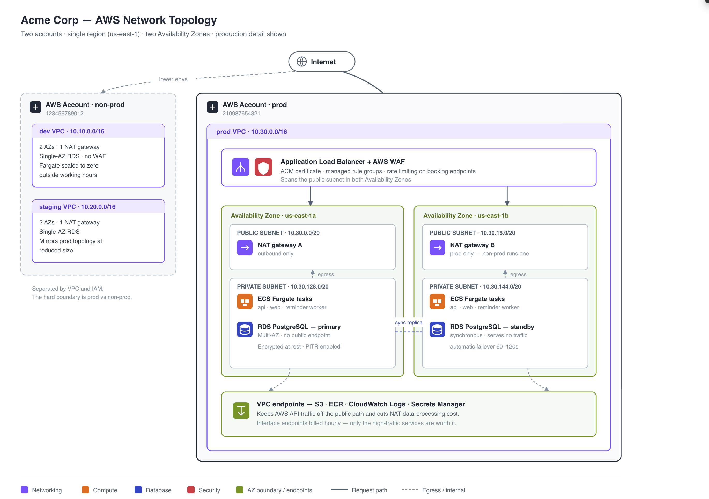
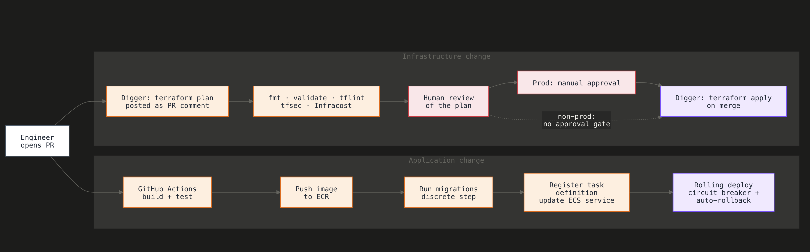

# Architecture

How Acme's platform runs on AWS, why it's shaped this way, what we deliberately
left out, and how a four-person team ships to it. This document is the "read this
first" overview; `docs/design-aws.md` goes deeper on the mechanics.

## Constraints and assumptions (what this was sized to)

Every decision below is calibrated to these numbers. If they change by an order
of magnitude, revisit the design — see [EVOLUTION.md](EVOLUTION.md).

| Dimension | Today | After planned 3x (12 mo) |
|---|---|---|
| Clinic customers | ~200 | ~600 |
| Patients booked / month | ~40,000 | ~120,000 |
| Booking throughput | ~1 / minute | ~3 / minute |
| Engineers | 4 | 4–8 |
| Regions | 1 (us-east-1) | 1 |
| Data sensitivity | Health-adjacent PII (names, contact, appointment types) — treated as sensitive; company sells on trust | unchanged |

Assumptions:

- The application is a single containerized REST API, a web app, and a
  background worker — we do **not** own or change the app source here; images are
  built elsewhere and referenced by tag.
- Traffic is steady and low-volume; there is no evidence of spiky, unpredictable
  load that would justify autoscaling machinery today.
- Reminders are time-sensitive but tolerant of a small dispatch window (minutes,
  not seconds).
- HIPAA-adjacent posture is required now; formal certification (SOC 2) is not yet
  demanded by customers.

## 1. Diagram

Two views. The **network topology** below shows the accounts, VPCs, subnets, and
Availability Zones — what runs where. The **deployment flow** — how the team ships
changes — is in [Section 4](#4-how-the-four-engineers-deploy-to-it).

## 2. Why this shape — key decisions and trade-offs

**ECS Fargate, not EKS or EC2.** Three long-running services and a worker do not
justify a Kubernetes control plane or a node fleet for four engineers. Fargate
removes host patching and capacity management entirely — the single biggest
operational win over the hand-built VM. Trade-off: less control and higher
per-task cost than EC2, both immaterial at this scale.

**A scheduled sweeper, not per-appointment scheduled messages.** EventBridge
Scheduler fires every minute; the worker queries appointments whose reminder is
due and not yet sent, enqueues them to SQS, and a consumer sends them.
Appointments are rescheduled and cancelled constantly, so keeping the database as
the single source of truth is far more robust than maintaining thousands of
individually-scheduled messages that must be kept in sync with a mutating
calendar. Idempotency comes from a unique constraint on
`(appointment_id, reminder_type, target_send_at)`. Trade-off: a fixed sweep
interval adds up to a minute of latency — negligible against the 15-minute SLO.

**RDS PostgreSQL, Multi-AZ in prod.** Managed Postgres gives automated backups,
patching, and one-flag failover. Multi-AZ is on in prod (health-adjacent data,
trust-based sales) and off in the lower environments to save cost. Master
credentials are managed by RDS directly in Secrets Manager, so no password ever
lands in Terraform state.

**Two AWS accounts (prod, non-prod), not three.** A hard prod boundary is
non-negotiable for blast radius and PHI isolation. A third account for dev alone
adds IAM and billing overhead a four-person team would feel every day, so dev and
staging share the non-prod account, separated by VPC and IAM. Trade-off: weaker
isolation between dev and staging than a full account split — acceptable, since
neither holds production data.

**Per-environment root modules over a shared module library.** `envs/{dev,staging,prod}`
each compose the same `modules/`. This is explicit and readable — a teammate sees
exactly what an environment contains — and avoids the indirection of Terragrunt,
which isn't warranted for three environments. Trade-off: some repetition in the
env root files, which we accept for legibility.

**Datadog over raw CloudWatch.** CloudWatch is the substrate; Datadog is where
SLOs, monitors, and APM live, defined as code via its Terraform provider. We page
on exactly three things and route everything else to Slack, because alert fatigue
is the real failure mode for a small on-call rotation.

**SLOs and the three paging monitors.** Two SLOs are defined in code, both over a
30-day window: **booking API availability at 99.9%** (successful booking API
responses over total) and **reminder dispatch latency at 99%** (reminders sent
within 15 minutes of target over total). Exactly three monitors page — via
PagerDuty in prod, Slack in lower environments (gated by `enable_paging`):

- **Reminder delivery failures** — more than 10 failed deliveries in 10 minutes. A
  broken reminder pipeline breaks the core product promise.
- **Booking API availability SLO fast burn** — error-budget burn rate above 14.4×
  (1-hour long / 5-minute short window). Booking is failing fast enough to blow the
  monthly budget.
- **RDS unavailable or connections saturated** — database connections above 80 for
  5 minutes. The database is the single source of truth; near saturation, every
  path stalls.

Everything else — DLQ not empty, sustained ECS CPU, low RDS free storage — routes
to Slack by severity without paging, so a four-person on-call isn't woken for what
can wait until morning.

**WAF at seed stage.** Defensible specifically because the data is
health-adjacent and sold on trust — AWS managed rule groups are cheap insurance
against common web attacks on patient-facing booking pages, plus a single
rate-based rule on the booking path to blunt abuse and scraping. WAF is enabled
in staging and prod; dev omits it to save cost. We did not write further custom
rules; that would be premature.

**AWS, with GCP evaluated.** Both clouds were designed out before building; AWS was
chosen because it's where every decision here can be defended under live
discussion, and the brief invites picking the provider you're most comfortable
with. The differences are structural, not blocking: GCP's **global VPC** plus
org-policy guardrails would shrink the per-environment networking surface (no
per-VPC interface endpoints, a centrally-enforced "no public database"), while
**Cloud Run's** revision-based, scale-to-zero model would remove the ECS cluster,
task definitions, and target groups — at the cost of a Serverless VPC connector to
reach a private Cloud SQL. The full mapping, including the Pub/Sub reminder
pipeline and Workload Identity Federation for CI, is in
[docs/design-gcp.md](docs/design-gcp.md).

## 3. What was deliberately left out or kept simple, and why

This is a deliberate scope, not an incomplete one. Each omission has a trigger in
[EVOLUTION.md](EVOLUTION.md).

- **No reactive autoscaling.** At ~1–3 bookings/minute, fixed task counts (1
  non-prod, 2 prod) are correct; policies that react to load would guard against
  load that doesn't exist. The one exception is driven by cost, not load: dev runs
  on a *scheduled* scale-to-zero outside working hours.
- **No Kubernetes / EKS, no service mesh.** Nothing here needs them; they would be
  pure operational overhead.
- **No multi-region.** Single region is the deliberate availability ceiling.
  Multi-region triples complexity and cost for a resilience level no customer is
  asking for yet.
- **No RDS Proxy, read replicas, or caching layer.** Connection counts and read
  load are tiny. Adding these now optimizes a problem we don't have.
- **No customer-managed KMS keys, no egress firewall.** AWS-managed encryption
  satisfies the current posture; CMK and Network Firewall are auditor/contract
  triggered.
- **No Terragrunt, Terratest, or pre-commit framework.** `validate` + `fmt` + a
  non-blocking lint/scan job in CI cover quality without a platform-team toolchain.
- **No PR/ephemeral environments.** Staging is shared; contention isn't a problem
  at four engineers.
- **Static security scanning is present but non-blocking.** tflint and tfsec run
  in CI and annotate findings; they do not gate merges, which would slow a small
  team more than it helps today.

## 4. How the four engineers deploy to it

Day-to-day flow, described independent of the exact YAML in
`.github/workflows/`:

**Infrastructure changes (Terraform):**
1. An engineer opens a pull request touching `terraform/`.
2. CI assumes a **read-only** role via GitHub OIDC (no static keys) and Digger
   posts a `terraform plan` as a PR comment, alongside an Infracost cost delta and
   non-blocking tflint/tfsec findings.
3. A teammate reviews the plan and approves the PR.
4. On merge to `main`, Digger applies to the **non-prod** environments
   automatically using a scoped apply role.
5. **Prod is gated:** applying to prod requires a manual approval through the
   `prod` GitHub Environment, and the prod apply role's trust policy only accepts
   tokens carrying the `environment:prod` claim — so prod cannot be changed
   without that approval, even from `main`.

**Application changes (new image):**
1. The app repo builds and pushes an image to ECR.
2. The Build & Deploy workflow rolls the staging ECS services
   (`update-service --force-new-deployment`).
3. Promotion to prod waits on the same `prod` environment approval, then rolls the
   prod services.

Rollback is redeploying the previous image tag (or reverting the Terraform PR),
both through the same reviewed path.

## Migration and cutover — getting off the VM

The current system is one hand-built VM (API + web + worker + Postgres) with SSH
deploys. Cutover, ordered to minimize risk and downtime:

1. **Stand up infrastructure.** Apply Terraform to non-prod, then prod, with empty
   databases. No traffic yet.
2. **Containerize and publish.** The app team builds images and pushes to ECR;
   deploy them to staging and validate end-to-end against a copy of data.
3. **Pre-stage DNS.** Lower the TTL on `api.` and `app.` records to a few minutes
   a day ahead, so the final flip propagates quickly.
4. **Dry-run the data migration.** `pg_dump` from the VM, restore into RDS,
   measure how long it takes (trivial at ~tens of GB) and fix any schema/extension
   gaps.
5. **Cutover window** (short, scheduled off-peak): put the app in maintenance/
   read-only, take a final `pg_dump`, restore to RDS, point the prod ECS services
   at RDS, and flip DNS to the ALB.
6. **Verify and watch.** Confirm bookings, reminders, and the three P1 monitors
   are healthy. Keep the VM running but idle as a rollback target.
7. **Rollback plan.** If something is wrong, flip DNS back to the VM — its
   database is untouched during the window. Decommission the VM only after a few
   days of stable operation.

For this volume a brief maintenance window is simpler and safer than a live
dual-write migration; DMS/replication is deferred unless zero-downtime becomes a
hard requirement.

## Cost estimate

Rough monthly, us-east-1, on-demand, excluding data transfer noise. Datadog is a
separate SaaS bill and is called out on its own.

| Item | Prod (~/mo) | Non-prod dev+staging (~/mo) |
|---|---|---|
| Fargate tasks (6 prod: api/web/worker ×2; ~3 non-prod) | ~$110 | ~$55 |
| RDS PostgreSQL (t4g.medium Multi-AZ prod; t4g.small single-AZ ×2) | ~$100 | ~$70 |
| NAT gateways (2 prod, 1 per non-prod env) | ~$70 | ~$70 |
| Application Load Balancer | ~$20 | ~$35 |
| WAF (WebACL + 3 managed rule groups) | ~$15 | ~$15 |
| Secrets Manager, ECR, CloudWatch logs, SQS, Scheduler | ~$30 | ~$25 |
| **AWS subtotal** | **~$345** | **~$270** |

> Non-prod ALB and WAF look off but aren't: the non-prod ALB line covers **two**
> load balancers (dev and staging) against prod's one, and the non-prod WAF line
> is **staging only** — dev omits WAF (see Section 2).

Total AWS: **roughly $600–650/month** across all environments. **Datadog** adds
roughly **$100–250/month** depending on host/APM volume. NAT gateways are the
largest fixed line and the first cost lever if it matters (single NAT in prod, or
VPC endpoints already reduce cross-NAT traffic to AWS APIs).

## Failure modes

| Failure | Blast radius | Mitigation in this design |
|---|---|---|
| Single AZ outage | Partial | 2 AZs; ALB + Fargate spread; RDS Multi-AZ failover in prod |
| RDS primary failure | Brief write outage | Multi-AZ automated failover (~1–2 min); backups for worse cases |
| A Fargate task crashes | Minimal | ECS restarts tasks; ≥2 tasks in prod keep serving |
| NAT gateway failure (prod) | Partial egress loss | 2 NAT gateways, one per AZ, in prod |
| Reminder worker down | Reminders delay, not lost | Sweeper re-queries DB each minute; unsent reminders picked up on recovery; P1 monitor pages |
| SQS consumer backs up / poison message | Delayed reminders | DLQ after 5 receives; non-paging DLQ monitor |
| Third-party SMS/email outage | Reminders fail | Delivery-failure P1 monitor; messages retried; DB remains source of truth |
| Bad deploy | Service degradation | Staging first; prod gated by approval; roll back to prior image |
| Datadog outage | Blind, not down | Alerting degraded; CloudWatch substrate still records metrics/logs |
| Secret leak in logs | Confidentiality | PHI/secret scrubbing in logs and APM; secrets injected at runtime, never in state |
